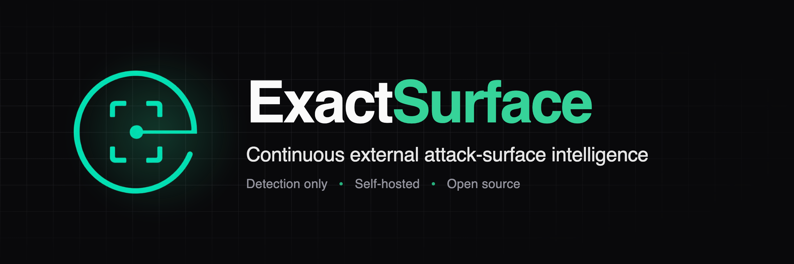
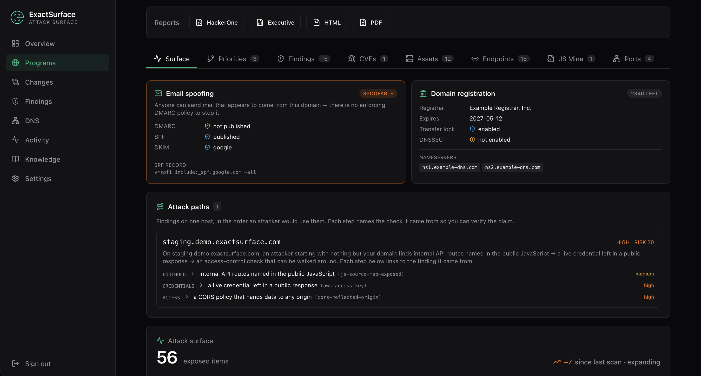
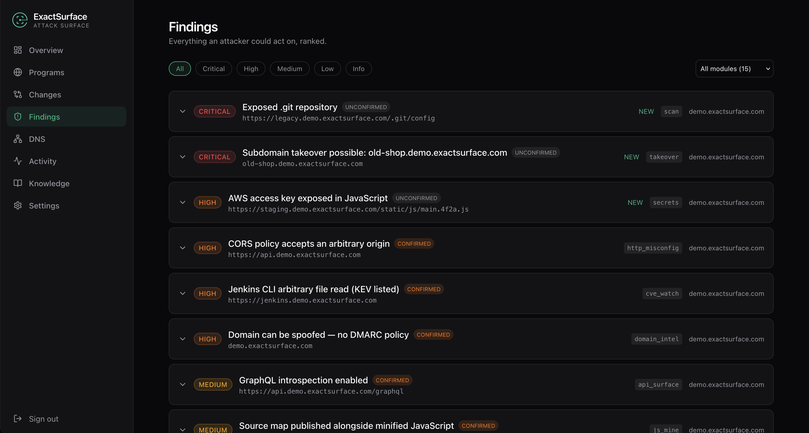
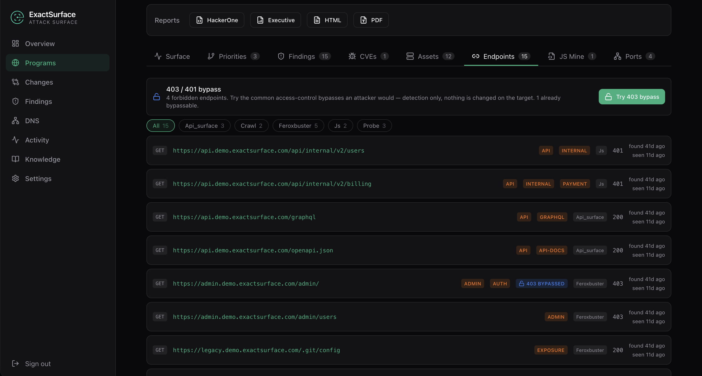

<p align="center">
  
</p>

<p align="center">
  <a href="https://exactsurface-demo.vercel.app"><b>Live demo</b></a> ·
  <a href="https://whxitte.github.io/exact-surface/"><b>Website</b></a> ·
  <a href="docs/ARCHITECTURE.md"><b>Documentation</b></a> ·
  <a href="CHANGELOG.md"><b>Changelog</b></a> ·
  <a href="https://github.com/whxitte/exact-surface/releases"><b>Releases</b></a>
</p>

<p align="center">
  <a href="https://github.com/whxitte/exact-surface/actions/workflows/ci.yml"></a>
  <a href="https://github.com/whxitte/exact-surface/releases"></a>
  <a href="https://github.com/whxitte/exact-surface/pkgs/container/api"></a>
  <a href="LICENSE"></a>
  
  
</p>

---

**ExactSurface** answers one question, continuously, for every domain you own:

> *What does an external attacker see right now, and what can they do with it?*

It runs the tooling real attackers use — subfinder, httpx, nuclei, katana, naabu,
feroxbuster and more — on a schedule, against infrastructure you have proven you
control. It is **state-aware** (one alert per genuinely new fact, not one per re-scan),
**multi-tenant** from line one, **self-hosted** with nothing phoning home, and it
**never exploits — only detects**.

## Why ExactSurface

| | |
|---|---|
| **Continuous, not one-off** | A scheduler re-runs each of 28 modules on its own cadence. Results upsert by content-hash fingerprint, so a re-scan that finds nothing new says nothing — and the moment something changes, you hear about it once. |
| **Scope by construction** | A central scope engine decides what each scan may touch. Hosts must belong to a DNS-verified domain; internal, metadata and CDN addresses are refused; aggressive scanning needs IP ranges confirmed yours via ASN lookup. Self-attestation unlocks nothing. |
| **Findings you can verify** | Findings carry the reproduction behind them — the attacker's own `curl`, not a paraphrase — and a triage lifecycle (new → triaged → confirmed → resolved) so a team can work them. Correlation groups findings per host into ranked attack chains and retells them as an **attack path** in the order an attacker would use them. |
| **A visual Playground** | Drag modules onto a canvas, wire one's output into another's input, and run it — through the same dispatch table a scheduled scan uses, so the canvas and the scheduler can't drift apart. |
| **Your data stays yours** | Runs entirely on your infrastructure. No hosted service, no licence key, no telemetry. Discovered secrets are masked before they are stored, logged, exported or alerted. |
| **Built to be read** | The controls that matter each have an ADR explaining what they guarantee and what they don't. `docs/SECURITY.md` states the trade-offs plainly rather than pretending they don't exist. |

## What it looks like

<p align="center">
  
</p>
<p align="center"><sub>A program's surface: passive domain intelligence, and an attack path stitched from three findings on one host.</sub></p>

<p align="center">
  
</p>
<p align="center"><sub>Findings, ranked. Each names the module that found it and its triage state.</sub></p>

<p align="center">
  
</p>
<p align="center"><sub>Every endpoint discovered by crawling, content discovery, JavaScript mining and API disclosure — with risk tags.</sub></p>

All screenshots are from the [live demo](https://exactsurface-demo.vercel.app), which is
the real frontend running against fictional seeded data. Nothing to sign up for.

## Quickstart

### Run it locally

```bash
git clone https://github.com/whxitte/exact-surface.git && cd exact-surface
cp .env.example .env         # edit the secrets before anything reachable
docker compose -f docker/docker-compose.yml up --build
```

| | |
|---|---|
| Dashboard | http://localhost:3000 |
| API | http://localhost:8000 — health at `/healthz`, docs at `/docs` |
| Grafana | http://localhost:3001 (`admin` / `admin` in dev) |

Sign up in the UI — **the first account becomes the instance owner**, after which public
signup closes and the owner adds members — then add a domain you control and complete DNS
verification. The first build compiles the Go recon toolchain and takes 5–15 minutes;
later starts are fast.

**Requirements.** Docker Engine 24+ with the Compose plugin. For production, 4 vCPU /
8 GB RAM / 100 GB SSD is the floor and 8 / 16 / 250 is comfortable; RAM matters most,
because many subdomains get probed at once.

### Deploy it for real

[`deploy/`](deploy/) is a self-contained folder: the compose file, Caddy for automatic
TLS, Prometheus and Grafana provisioning, and an `.env` template. It pulls the published
images rather than building.

```bash
cd deploy && cp .env.example .env   # set DOMAIN and the datastore secrets
docker compose up -d
```

[`docs/OPERATIONS.md`](docs/OPERATIONS.md) covers requirements, sizing, upgrades,
backups and monitoring. Images are published to GHCR for `amd64` and `arm64` (the
`pipeline` image is `amd64` only).

### Develop without Docker

```bash
make venv && make install    # .venv + dependencies
make dry-run                 # config, scope feeds, binaries, Mongo, Redis — no network
make test                    # the suite
make lint                    # ruff check + ruff format --check, exactly what CI runs
```

## ⚠️ Authorised use only

ExactSurface actively probes hosts over the network. Point it only at infrastructure you
own or have **written permission** to test. Unauthorised scanning is illegal in most
jurisdictions regardless of intent, and "I was only enumerating" is not a defence.

The product is built so this is hard to get wrong by accident:

- A program cannot be scanned until its apex domain passes **DNS-TXT verification**.
- The **scope engine** refuses internal, metadata, CDN and out-of-scope addresses by
  construction, not by a checklist someone remembers to apply (ADR-0005).
- Port scanning, content discovery and the full nuclei corpus need IP ranges
  **confirmed** yours via ASN lookup. Declaring a `/24` you don't own gets you HTTP-layer
  probing and nothing more (§9b).
- nuclei runs with `dos,intrusive,fuzz` excluded. There is no exploitation path in this
  codebase, and pull requests adding one will not be merged.

One per-program switch, **off by default**, waives the scope engine for operators
scanning infrastructure they own but cannot prove they own — hosts behind a CDN, an
internal range, a cloud block the ASN check won't confirm. It does not waive your own
exclusion lists, the rate cap, the verification requirement, or the link-local block:
`169.254.169.254` is the *worker's own* metadata service, and no override reaches it.
Every flip is logged. [`docs/SECURITY.md`](docs/SECURITY.md) §2 explains what each
control actually guarantees.

## What it scans

The pipeline mirrors a real black-box engagement, in order. Every module can be toggled
per program and has its own re-run cadence; modules depend on each other, so disabling
one also stops whatever consumes its output — the UI says so before you confirm.
Subdomain discovery and live-host probing are required.

| Module | What it does |
|---|---|
| Domain intelligence | Email spoofability (SPF/DMARC/DKIM) + registration risk (expiry, transfer lock, DNSSEC). Fully passive. |
| Subdomain discovery | subfinder + crt.sh + DNS, plus **alterx permutations** (only names DNS confirms are kept). *Required.* |
| **Cloud asset inventory** | Asks your own AWS/GCP/Azure/DigitalOcean accounts what they run, finding assets no DNS name points at. Read-only credentials stay in your deployment. Opt-in. |
| Internet-index search | Shodan/Censys/Fofa via uncover. Opt-in. |
| **Reverse-DNS sweep** | PTR-sweeps IP ranges confirmed yours, finding hosts that exist in IP space but were never published in DNS. Opt-in; ASN-verified ranges only, never wider than a /20. |
| Live-host probing | httpx — alive check + technology fingerprint. *Required.* |
| TLS inspection | Certificate expiry and weak configuration. Opt-in. |
| Subdomain takeover | Dangling DNS pointing at claimable cloud services. |
| Crawling & archives | katana + gau/waybackurls. |
| Content discovery | feroxbuster (ffuf fallback), tech-aware wordlists. |
| **JavaScript mining** | Mines your own JS bundles for API routes, internal hostnames and source maps; discovered paths feed back as endpoints. |
| **API & path disclosure** | robots.txt + sitemap mining, OpenAPI/Swagger detection, GraphQL introspection, `.well-known`. Paths found become endpoints. |
| **CORS, redirects & WAF** | Reflected/null-origin CORS with credentials, open redirects (only on parameters the site already uses), and which hosts sit behind a WAF. |
| **Hidden parameters** | Inventories the query parameters your pages already use (free), and probes a curated list for undocumented ones that change behaviour. Opt-in. |
| **Broken-link hijacking** | Outbound links to unregistered domains or unclaimed social handles. |
| Port scanning | naabu, on confirmed-dedicated infrastructure only. |
| Service fingerprinting | nmap -sV. Opt-in. |
| Vulnerability scanning | Full nuclei corpus, tech-targeted. |
| Exposed secrets | Page/script bodies scanned for keys and tokens (masked, never stored raw). |
| CVE watch | NVD + CISA KEV matched to fingerprinted software. |
| Public code leaks | GitHub code search for secrets tied to the domain. |
| Cloud storage exposure | S3/GCS/Azure bucket enumeration. Opt-in. |
| New-template watch | Alerts when a newly published nuclei template starts matching your stack. Opt-in. |
| Search-engine exposure | Dorking. Opt-in (needs a search API key). |
| **Dependency confusion** | Internal package names in your public JS that nobody has claimed on npm. |
| **Lookalike domains** | Registered typosquats aimed at phishing your staff and customers; MX records rank higher. Opt-in. |
| Risk correlation | Groups findings per host into ranked attack chains, retold as an **attack path** in attacker order. |
| Alerting | Delivers new findings to Slack, Discord, Telegram, email or a webhook. |

On demand, from the Endpoints tab: **403/401 bypass**.

## The Playground

`/playground` is an n8n-style canvas for running the same modules by hand: drag nodes
out of a palette, set their parameters, wire one node's output into another's input, and
run it. 36 nodes — 28 pipeline modules, 6 utility transforms, a target source and an
output viewer.

It is deliberately **not** a second execution engine. The dataflow edge already existed
and was simply invisible: the scheduler held a graph of *phase → downstream phases*, every
recon pipeline already returned the hosts it found, and dispatch already accepted a
target list. The canvas exposes that pair and lets you rewire it, executing through the
same dispatch table a scheduled scan uses.

Pipeline nodes are *derived* from the module registry, so a new module appears on the
canvas the moment it is registered. Utility nodes are a hand-written allow-list — never
introspection — and a test asserts the module contains no `getattr(`, `importlib`,
`eval(` or `exec(`. Runs execute on the worker and report per-node progress onto the
canvas.

## How it works

```
                    ┌──────────────┐
                    │  scheduler   │  reads state, enqueues due work
                    └──────┬───────┘
                           ▼
                    ┌──────────────┐
                    │  Redis (arq) │
                    └──────┬───────┘
          ┌────────────────┼────────────────┐
          ▼                ▼                ▼
    ┌───────────┐    ┌───────────┐    ┌───────────┐
    │  worker   │    │  worker   │    │  worker   │   pipeline image: all recon tools
    └─────┬─────┘    └─────┬─────┘    └─────┬─────┘
          │  1. authorization record current?
          │  2. scope engine → which actions may this host receive?
          │  3. run the module, under the politeness cap
          ▼
    ┌───────────────────────────────────────────────┐
    │  MongoDB  — upsert by content-hash fingerprint │   idempotent, state-aware
    └───────────────────────┬───────────────────────┘
                            ▼
                   new or changed facts → notifications
```

A **scheduler** reads state and enqueues jobs. Stateless **workers** — the pipeline
image, carrying all the recon tools — pull jobs and, for each target: confirm a current
**authorization record**, get a **scope decision**, and run the module within its
permitted action set under a global **politeness rate cap**. Results upsert into
**MongoDB** by fingerprint, which is what makes re-scans idempotent and alerts
state-aware. The **API** serves JSON and never carries a scanner.

Three applications live in this repository; only the first is what you deploy.

| | What | Built from |
|---|---|---|
| **The product** | api + frontend + pipeline images, run from `deploy/` | `docker/Dockerfile.{api,frontend,pipeline}` |
| **The demo** | the real frontend with one file swapped for static fixtures | `demo/` |
| **The workbench** | a local-only module test bench, never containerised | `devtools/` |

The product Dockerfiles copy named directories only — never `COPY . .` — so `demo/` and
`devtools/` never enter a product image, and `tests/unit/test_wiring.py` fails the build
if that is undone. The project site lives on the `site` branch and carries nothing else.

## Documentation

| Read this | For |
|---|---|
| [`docs/ARCHITECTURE.md`](docs/ARCHITECTURE.md) | **start here** — the loop, the layers, the five control points, the data model |
| [`docs/SECURITY.md`](docs/SECURITY.md) | the control model: authorization chain, scope enforcement, tenant isolation, secret handling |
| [`docs/OPERATIONS.md`](docs/OPERATIONS.md) | running it in production: requirements, install, backups, upgrades, scaling, monitoring |
| [`docs/TESTING.md`](docs/TESTING.md) | running it end to end against a target you control |
| [`docs/API.md`](docs/API.md) | endpoint reference, plus the rules a schema cannot show |
| [`docs/ADRs/`](docs/ADRs/) | why things are the way they are — read before changing a control |
| [`docs/FAQ.md`](docs/FAQ.md) | resetting a local instance, and the questions that keep coming up |
| [`docs/DEPLOYMENT.md`](docs/DEPLOYMENT.md) | roles, images, sizing, observability |
| [`docs/RELEASING.md`](docs/RELEASING.md) | cutting a release |
| [`docs/ROADMAP.md`](docs/ROADMAP.md) | the biggest gaps, and where to start if you want to close one |
| [`CHANGELOG.md`](CHANGELOG.md) | what changed in each version |

New here? `ARCHITECTURE.md` → `SECURITY.md` §2 (why domain control ≠ scanning
authorization) → ADR-0005 and ADR-0008. Those explain the constraints that shape
everything else.

## Support and community

- **Questions and ideas** → [GitHub Discussions](https://github.com/whxitte/exact-surface/discussions)
- **Bugs** → [GitHub Issues](https://github.com/whxitte/exact-surface/issues)
- **Security vulnerabilities** → privately, via [`SECURITY.md`](SECURITY.md) — never a public issue
- **What changed** → [`CHANGELOG.md`](CHANGELOG.md) and the [releases page](https://github.com/whxitte/exact-surface/releases)

## Contributing

Issues and pull requests are welcome — see [`CONTRIBUTING.md`](CONTRIBUTING.md). Two
things to know first: **the safety controls are not negotiable** (detection only; a
change that weakens the scope engine, the politeness cap or the authorization gate needs
an ADR arguing the case), and **registries must not drift** — a module lives in seven
places, and `tests/unit/test_wiring.py` fails naming whichever one you missed.

Found a security bug? Report it privately — [`SECURITY.md`](SECURITY.md).

> A recurring lesson from building this: the failures worth worrying about are not the
> ones a green test suite catches. Every serious bug this project has shipped was found
> by *using* it, never by reading the code. Treat "tests pass" as necessary, not
> sufficient.

## Licence

[Apache-2.0](LICENSE). Use it, modify it, redistribute it — commercially and in
closed-source products included — subject to the attribution and patent terms.

The bundled scanning tools (subfinder, httpx, nuclei, katana, naabu, feroxbuster, nmap
and others) are third-party software under their own licences, downloaded into the
pipeline image at build time and not redistributed here.
